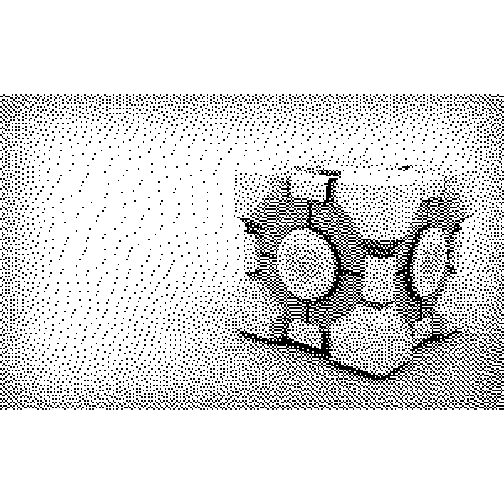

`dithr` Error Diffusion Ditheing in Rstats
==============================================================================

A small R package for error diffusion dithering in R.  

Comes with 10 pre-defined error diffusion matrices:

* one_d 
* floyd_steinberg 
* fake_floyd_steinberg 
* stucki 
* burkes 
* atkinson 
* jarvis_judice_ninke 
* sierra 
* two_row_sierra 
* sierra_lite


**To Do**

* Serpentine error diffusion (i.e. alternating traversal direction every row)
* Because of the way I'm dealing with the edge of the image, there's a slight leak of error diffusion from elements outside the boundary back into the actual matrix.
  Not worth fixing at this stage.


Installation
------------------------------------------------------------------------------


```r
# install.packages('magick')
# source("https://bioconductor.org/biocLite.R")
# biocLite("EBImage")
devtools::install_bitbucket('coolbutuseless/dithr')
```


Example
------------------------------------------------------------------------------


```r
#-----------------------------------------------------------------------------
# Using imagemagick to load and convert the image to grayscale
#-----------------------------------------------------------------------------
im <- magick::image_read("./figure/Portal_Companion_Cube.jpg") %>%
  magick::image_convert(type = 'grayscale') %>% 
  magick::image_scale(geometry="50%")
  

#-----------------------------------------------------------------------------
# Extract the matrix of values
#-----------------------------------------------------------------------------
m <- magick::as_EBImage(im)@.Data

#-----------------------------------------------------------------------------
# Show the original image
#-----------------------------------------------------------------------------
dithr::plot_matrix(m)
```


```r
dithered_matrix <- dithr::dither(m, dithr::diffusion_matrix$floyd_steinberg)
dithr::plot_matrix(dithered_matrix)
```



